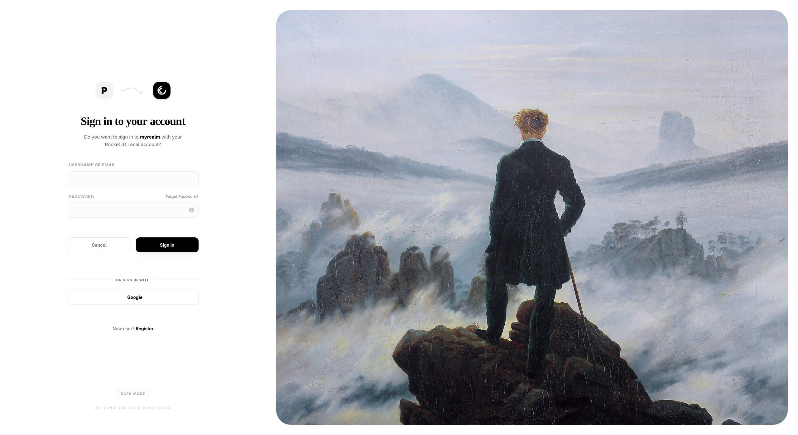

# Modern Keycloak Theme

Ce thème a été entièrement conçu avec [Keycloakify](https://www.keycloakify.dev/), en s'inspirant du design moderne et épuré de [Pocket ID](https://github.com/stonith404/pocket-id). 

Il propose une mise en page sophistiquée en écran partagé, intégrant l'œuvre classique de Caspar David Friedrich et un support dynamique pour les modes sombre et clair.

### Résultat final :

